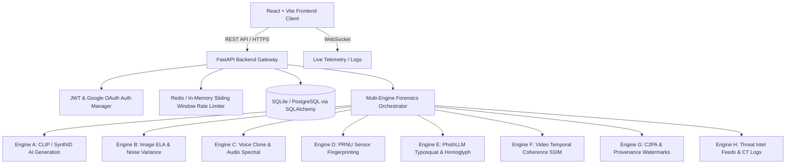

# Implementation Plan — Shield.AI Comprehensive Master Architecture

**Shield.AI** is an enterprise-grade multimodal cybersecurity and digital forensics platform designed to detect deepfakes, manipulated media, voice clones, and phishing infrastructure in real time.

---

## 1. System Architecture & High-Level Design



---

## 2. Core Forensic Detection Engines

### 2.1 Engine A: CLIP AI Generation & Artifact Detection
* **Purpose:** Detects synthetic pixel patterns and diffusion/GAN generation artifacts.
* **Implementation:** Weighted secondary feature fusion with configurable runtime toggles (`ENABLE_CLIP`).

### 2.2 Engine B: Image Error Level Analysis (ELA)
* **Purpose:** Detects composite splicing, copy-move forgery, and localized resaving.
* **Implementation:** Re-compresses images at specific JPEG quality factors, computes differential pixel matrices, and generates dynamic visual heatmaps.

### 2.3 Engine C: Audio Voice-Clone & Spectral Forensics
* **Purpose:** Detects cloned voices, synthetic vocoders, and AI speech synthesis.
* **Implementation:** Computes Harmonics-to-Noise Ratio (HNR), Mel-Frequency Cepstral Coefficients (MFCC), jitter, shimmer, and spectral subband distributions inspired by AASIST.

### 2.4 Engine D: PRNU Sensor Fingerprinting
* **Purpose:** Verifies hardware sensor noise signatures to detect non-optical generative imagery.
* **Implementation:** Wavelet-based denoising filter extraction with 2D cross-correlation against standard camera sensor patterns.

### 2.5 Engine E: PhishLLM Heuristics & Typosquatting Scanner
* **Purpose:** Blocks targeted phishing, lookalike domains, and credential harvesters.
* **Implementation:** Checks Unicode homoglyphs, Levenshtein distances against 50+ high-value brands (banking, tech, telecom), and TLD mismatch heuristics.

### 2.6 Engine F: Video Frame-by-Frame Temporal Coherence
* **Purpose:** Detects face-swap boundaries, facial warps, and inter-frame GAN flickering.
* **Implementation:** Demuxes video streams via `imageio-ffmpeg`, tracks facial ROI bounding boxes, and calculates structural similarity (SSIM), luminance variance, and edge blockiness across timeline frames.

### 2.7 Engine G: C2PA Provenance & Cryptographic Watermarks
* **Purpose:** Inspects metadata provenance chains, Content Authenticity Initiative (CAI) manifests, and embedded steganographic watermarks.

### 2.8 Engine H: Live Threat Intelligence & Certificate Transparency
* **Purpose:** Enriches domain audits with global threat telemetry.
* **Implementation:** Asynchronous multi-feed lookups against URLhaus, PhishTank, and crt.sh Certificate Transparency logs using `asyncio.gather`.

---

## 3. Platform Modules & Features

### 3.1 Admin Management Portal
* **Single Admin Access:** Restricted access for authorized administrators (`ADMIN_EMAILS`) via verified JWT claims (`is_admin: true`).
* **Audit Overview:** Live platform activity metrics, user ledger, and system-wide scan history with search and pagination.

### 3.2 Robust Multi-Tier Upload Validation
* **Tier 1 (Normalization):** Cleans client headers; falls back to `mimetypes.guess_type` for generic `application/octet-stream` drops.
* **Tier 2 (Fast-Path Whitelist):** Evaluates sanitized MIME types against configuration whitelists.
* **Tier 3 (Binary Sniffing):** Inspects magic bytes (JPEG `FF D8 FF`, PNG `89 50 4E 47`, WebP `RIFF...WEBP`, MP4 `ftyp`, etc.) and Pillow binary header verification.
* **Tier 4 (Size & DoS Guard):** Enforces configurable size limits per media type with empty file guardrails.

### 3.3 Community Scam Intelligence
* **Crowdsourced Database:** SQLite database models (`ScamReport`, `ScamComment`, `User`, `ScanHistory`).
* **Interactive Discussion Board:** Threaded comment system with upvoting for reported scam campaigns.

---

## 4. Verification & Testing Matrix

### 4.1 Automated Backend Suite
```bash
# Execute full backend test matrix (56+ automated tests)
pytest backend/
```
* **Coverage:** Authentication, MIME sniffing, 8 forensic engines, rate limiting, and database models.

### 4.2 Frontend Production Build
```bash
# Validate client bundle compilation and assets
npm run build --prefix frontend
```

---

## 5. Deployment & Infrastructure
* **Containerization:** Docker container with non-root security user, multi-stage builds, and Python 3.11 base.
* **Health Monitoring:** `/health` and `/health/deep` endpoints monitoring database latency, Redis health, and disk usage.
* **Host Compatibility:** Configured for Render static site + web service deployment (`render.yaml`).
